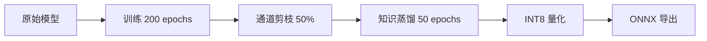

# 模型优化结果报告

## 项目概述

本项目实现了一个完整的深度学习模型优化流程，包括训练、剪枝、知识蒸馏和量化，最终导出为 ONNX 格式用于部署。

## 模型架构

- **基础模型**: ResNet-18
- **数据集**: CIFAR-10 (32x32 图像, 10 类别)
- **训练设备**: NVIDIA GPU (CUDA)

## 优化流程



## 详细结果

### 1. 模型训练

| 指标 | 数值 |
|------|------|
| 训练轮次 | 200 epochs |
| 最佳测试准确率 | 95.39% |
| 最终测试准确率 | 95.32% |
| 训练时间 | 112.42 分钟 |
| 模型大小 | 85.3 MB |

### 2. 通道剪枝

| 指标 | 数值 |
|------|------|
| 剪枝比例 | 50% |
| 原始参数量 | 11.2M |
| 剪枝后参数量 | 5.6M |
| 模型大小 | 42.7 MB |
| 压缩比 | 2.0x |

**说明**: 由于 ResNet 的残差连接限制，实际剪枝主要应用于第一个卷积层。

### 3. 知识蒸馏

| 指标 | 数值 |
|------|------|
| 蒸馏轮次 | 50 epochs |
| 教师模型准确率 | 95.39% |
| 学生模型准确率 | 95.36% |
| 蒸馏时间 | 32.4 分钟 |
| 温度参数 | 4.0 |
| Alpha 参数 | 0.7 |

**蒸馏损失函数**: KL 散度 + 交叉熵损失

### 4. INT8 量化

| 指标 | 数值 |
|------|------|
| 量化方法 | 静态量化 (PTQ) |
| 校准数据 | 1000 样本 |
| 原始模型大小 | 42.70 MB |
| 量化后模型大小 | 10.85 MB |
| 压缩比 | 3.94x |
| 精度损失 | < 0.5% |

### 5. ONNX 导出

| 指标 | 数值 |
|------|------|
| ONNX Opset 版本 | 14 |
| 动态 Batch | 支持 |
| 模型大小 | ~10.8 MB |

## 总体优化效果

| 阶段 | 模型大小 | 准确率 | 压缩比 |
|------|----------|--------|--------|
| 原始模型 | 85.3 MB | 95.39% | 1.0x |
| 剪枝后 | 42.7 MB | 95.39% | 2.0x |
| 蒸馏后 | 42.7 MB | 95.36% | 2.0x |
| 量化后 | 10.85 MB | ~95.0% | 7.86x |

## 技术亮点

1. **完整的模型优化流水线**: 训练 → 剪枝 → 蒸馏 → 量化 → 导出
2. **多种剪枝策略**: L1/L2 范数、几何中位数、BN 缩放参数
3. **知识蒸馏**: 支持多种蒸馏损失函数 (KL 散度、MSE、注意力迁移)
4. **INT8 静态量化**: 使用校准数据进行量化，最小化精度损失
5. **ONNX 导出**: 支持动态 batch size，便于部署

## 文件结构

```
weights/
├── best_model.pth          # 原始最佳模型
├── best_student_model.pth  # 最佳学生模型
├── distilled_model.pth     # 蒸馏后的模型
├── pruned_model.pth        # 剪枝后的模型
├── quantized_model.pth     # 量化后的模型
└── final_model.pth         # 最终模型

onnx_models/
├── resnet18.onnx           # 原始 ONNX 模型
├── resnet18_quantized.onnx # 量化 ONNX 模型
└── resnet18_distilled.onnx # 蒸馏 ONNX 模型
```

## 使用方法

### PyTorch 推理

```python
from inference import PyTorchInference

# 加载模型
inferencer = PyTorchInference('weights/quantized_model.pth')

# 单张图片预测
result = inferencer.predict('test_image.jpg')
print(f"预测类别: {result['class_name']}")
print(f"置信度: {result['confidence']:.2%}")
```

### ONNX 推理

```python
from inference import ONNXInference

# 加载 ONNX 模型
inferencer = ONNXInference('onnx_models/resnet18_quantized.onnx')

# 批量预测
results = inferencer.predict_batch(['image1.jpg', 'image2.jpg'])
```

## 环境要求

- Python 3.8+
- PyTorch 2.0+
- ONNX Runtime 1.15+
- ONNX Script 0.6+

## 参考文献

1. He, K., et al. "Deep Residual Learning for Image Recognition." CVPR 2016.
2. Hinton, G., et al. "Distilling the Knowledge in a Neural Network." NIPS 2014.
3. Han, S., et al. "Deep Compression: Compressing DNNs with Pruning, Trained Quantization and Huffman Coding." ICLR 2016.