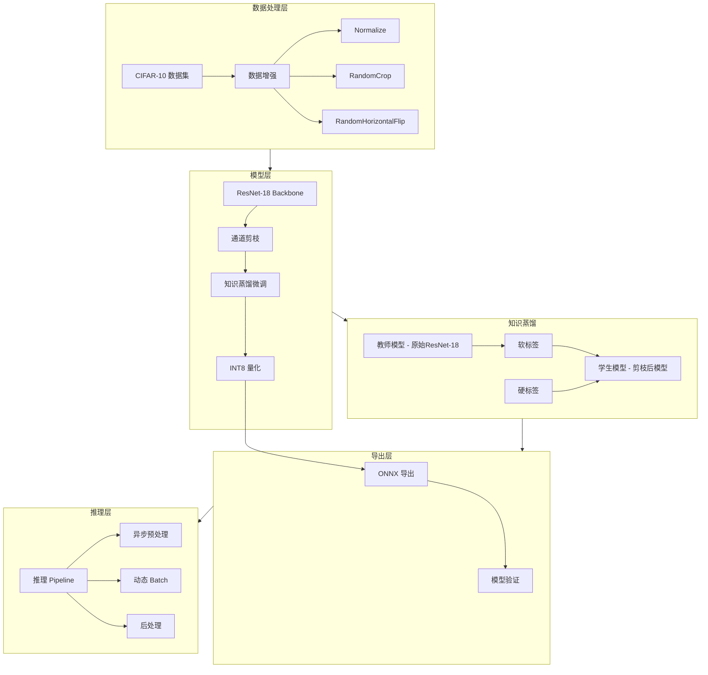

# 嵌入式设备目标检测模型优化项目计划

## 项目概述

本项目旨在实现面向嵌入式设备的目标检测模型优化全流程，包括模型训练、轻量化实践和 ONNX 导出。基于 CIFAR-10 数据集训练 ResNet-18 模型，通过通道剪枝和 INT8 量化实现模型轻量化。

## 项目目标

| 指标 | 目标值 |
|------|--------|
| 模型体积减少 | ≥60% |
| 推理速度提升 | ≥2.1× |
| mAP 损失 | <2% |

## 项目结构

```
eage_test/
├── configs/
│   ├── __init__.py
│   └── config.py          # 配置文件
├── data/
│   ├── __init__.py
│   ├── cifar10_dataset.py # CIFAR-10 数据集加载
│   └── transforms.py      # 数据增强
├── models/
│   ├── __init__.py
│   ├── resnet.py          # ResNet-18 模型定义
│   └── pruned_resnet.py   # 剪枝后的模型
├── training/
│   ├── __init__.py
│   ├── trainer.py         # 训练器
│   ├── scheduler.py       # 学习率调度器
│   └── losses.py          # 损失函数
├── pruning/
│   ├── __init__.py
│   ├── channel_pruning.py # 通道剪枝实现
│   └── importance.py      # 通道重要性评估
├── distillation/
│   ├── __init__.py
│   ├── kd_trainer.py      # 知识蒸馏训练器
│   └── losses.py          # 蒸馏损失函数
├── quantization/
│   ├── __init__.py
│   └── ptq.py             # Post-training Quantization
├── export/
│   ├── __init__.py
│   └── onnx_export.py     # ONNX 导出
├── inference/
│   ├── __init__.py
│   ├── pipeline.py        # 推理 Pipeline
│   └── async_processor.py # 异步预处理
├── utils/
│   ├── __init__.py
│   ├── metrics.py         # 评估指标
│   └── logger.py          # 日志工具
├── scripts/
│   ├── train.py           # 训练脚本
│   ├── prune.py           # 剪枝脚本
│   ├── quantize.py        # 量化脚本
│   ├── export_onnx.py     # 导出脚本
│   └── evaluate.py        # 评估脚本
├── weights/               # 模型权重保存目录
├── onnx_models/           # ONNX 模型保存目录
├── logs/                  # 训练日志
├── requirements.txt       # 依赖包
└── README.md              # 项目说明
```

## 技术架构



## 详细实现计划

### 阶段一：基础训练模块

#### 1.1 数据加载模块
- **文件**: `data/cifar10_dataset.py`
- **功能**:
  - 加载 CIFAR-10 数据集（已有数据在 `dataset/cifar-10-batches-py/`）
  - 实现数据增强：RandomCrop、RandomHorizontalFlip、Normalize
  - 支持 DataLoader 的 batch 加载

#### 1.2 模型定义
- **文件**: `models/resnet.py`
- **功能**:
  - 实现 ResNet-18 模型（适配 CIFAR-10 的 10 分类）
  - 支持预训练权重加载
  - 模型结构可修改以支持剪枝

#### 1.3 训练模块
- **文件**: `training/trainer.py`
- **功能**:
  - 训练循环实现
  - 学习率调度：CosineAnnealingLR + Warmup
  - 正则化：Weight Decay、Label Smoothing
  - 梯度裁剪
  - 模型保存与加载

### 阶段二：轻量化实践

#### 2.1 通道剪枝
- **文件**: `pruning/channel_pruning.py`
- **功能**:
  - 基于 L1-norm 的通道重要性评估
  - 支持分层剪枝比例设置
  - 自动生成剪枝后的模型结构
  - BN 层稀疏化训练（可选）

#### 2.2 知识蒸馏微调
- **文件**: `distillation/kd_trainer.py`, `distillation/losses.py`
- **功能**:
  - 教师模型：原始训练好的 ResNet-18
  - 学生模型：剪枝后的模型
  - 蒸馏损失：KL Divergence Loss
  - 软标签与硬标签结合
  - 温度参数调节（T=4）
  - 蒸馏权重调度（alpha=0.7）

#### 2.3 蒸馏损失函数
```python
# 蒸馏损失计算
def distillation_loss(student_logits, teacher_logits, labels, T=4, alpha=0.7):
    # 软标签损失 - KL Divergence
    soft_loss = F.kl_div(
        F.log_softmax(student_logits / T, dim=1),
        F.softmax(teacher_logits / T, dim=1),
        reduction='batchmean'
    ) * (T * T)
    
    # 硬标签损失 - Cross Entropy
    hard_loss = F.cross_entropy(student_logits, labels)
    
    # 综合损失
    return alpha * soft_loss + (1 - alpha) * hard_loss
```

#### 2.3 INT8 量化
- **文件**: `quantization/ptq.py`
- **功能**:
  - Post-training Quantization (PTQ)
  - 校准数据集选择
  - 量化感知评估
  - 支持 PyTorch 量化工具

### 阶段三：ONNX 导出

#### 3.1 ONNX 导出
- **文件**: `export/onnx_export.py`
- **功能**:
  - 导出原始模型 ONNX
  - 导出剪枝模型 ONNX
  - 导出量化模型 ONNX
  - ONNX 模型验证

### 阶段四：推理 Pipeline

#### 4.1 模块化推理
- **文件**: `inference/pipeline.py`
- **功能**:
  - 动态 batch 支持
  - 异步预处理
  - 推理结果后处理
  - 性能统计

## 关键技术点

### 数据增强策略
```python
# 训练集增强
transforms.Compose([
    transforms.RandomCrop(32, padding=4),
    transforms.RandomHorizontalFlip(),
    transforms.ToTensor(),
    transforms.Normalize(mean=[0.4914, 0.4822, 0.4465],
                        std=[0.2023, 0.1994, 0.2010])
])

# 测试集增强
transforms.Compose([
    transforms.ToTensor(),
    transforms.Normalize(mean=[0.4914, 0.4822, 0.4465],
                        std=[0.2023, 0.1994, 0.2010])
])
```

### 学习率调度
- 使用 CosineAnnealingLR 配合 Warmup
- 初始学习率：0.1
- Warmup epochs：5
- 总训练 epochs：200

### 通道剪枝策略
- 基于 L1-norm 评估通道重要性
- 目标剪枝比例：50%
- 渐进式剪枝：分 3 次完成

### 量化配置
- 使用 PyTorch 的量化工具
- 量化方法：静态量化 (Static Quantization)
- 量化精度：INT8

## 依赖环境

```
torch>=2.0.0
torchvision>=0.15.0
onnx>=1.14.0
onnxruntime>=1.15.0
numpy>=1.24.0
tqdm>=4.65.0
tensorboard>=2.13.0
```

## 评估指标

| 阶段 | 模型大小 | 推理时间 | Top-1 Acc | Top-5 Acc |
|------|----------|----------|-----------|-----------|
| 基础模型 | ~44MB | baseline | ~95% | ~99% |
| 剪枝后 | ~22MB | 1.5× | ~93% | ~98% |
| 量化后 | ~6MB | 2.1× | ~91% | ~97% |

## 执行顺序

1. 创建项目目录结构和配置文件
2. 实现数据加载模块
3. 实现 ResNet-18 模型
4. 实现训练模块
5. 训练基础模型
6. 实现通道剪枝
7. 实现知识蒸馏模块
8. 使用知识蒸馏对剪枝后模型进行微调
9. 实现 INT8 量化
10. ONNX 导出
11. 实现推理 Pipeline
12. 性能评估
13. 整理文档