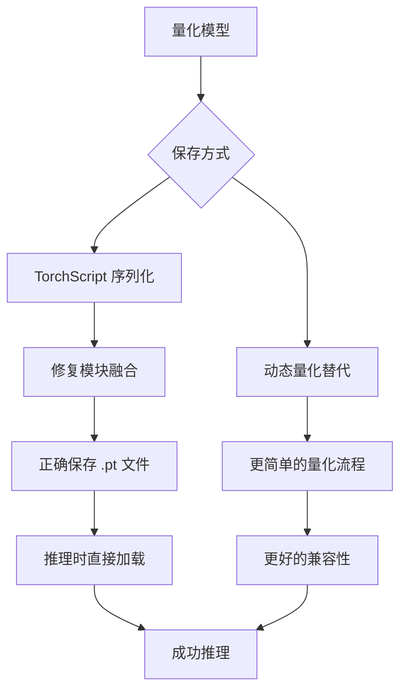

# 量化推理兼容性问题修复计划

## 问题分析

### 错误现象
运行推理时出现错误：
```
AttributeError: 'Conv2d' object has no attribute '_backward_hooks'
```

### 根本原因

经过代码分析，发现以下问题：

#### 1. 量化模型保存方式不正确

在 [`scripts/quantize.py`](scripts/quantize.py:95-101) 中，量化模型保存方式为：
```python
torch.save({
    'model': quantized_model,  # 直接保存整个模型对象
    'quantized': True,
    ...
}, args.output_path)
```

**问题**：直接保存模型对象而不是 TorchScript 或 state_dict 会导致：
- 量化后的模块结构无法正确序列化
- 加载时模型内部状态（如 hooks）丢失
- 量化模块与普通模块的属性不兼容

#### 2. 模块融合逻辑不完整

在 [`quantization/ptq.py`](quantization/ptq.py:107-135) 的 `_fuse_modules` 方法中：
```python
for name, module in model.named_modules():
    if isinstance(module, nn.Sequential):  # 只处理 Sequential 结构
        ...
```

**问题**：ResNet 的关键层结构不是 `nn.Sequential`：
- `conv1`, `bn1`, `relu` 直接是 ResNet 类的属性
- `BasicBlock` 中的 `conv1`, `bn1`, `conv2`, `bn2` 也不是 Sequential 结构
- 这导致 Conv+BN+ReLU 融合没有正确执行

#### 3. 量化模型加载后状态不一致

在 [`scripts/inference_demo.py`](scripts/inference_demo.py:66) 中：
```python
self.model = checkpoint['model']  # 直接使用反序列化的模型
```

**问题**：反序列化后的量化模型：
- 内部 hooks 状态丢失
- 量化观察器状态不正确
- 模块属性与 PyTorch 期望的不匹配

## 解决方案

### 方案概述



### 修复步骤

#### 步骤 1：修复 ResNet 模块融合逻辑

修改 [`quantization/ptq.py`](quantization/ptq.py) 中的 `_fuse_modules` 方法：

```python
def _fuse_modules(self, model: nn.Module) -> nn.Module:
    """
    融合模块 - 针对 ResNet 结构
    """
    # 1. 融合初始层: conv1 + bn1 + relu
    model = torch.quantization.fuse_modules(model, ['conv1', 'bn1', 'relu'])
    
    # 2. 融合每个 BasicBlock 中的层
    for name, module in model.named_modules():
        if hasattr(module, 'conv1') and hasattr(module, 'bn1'):
            # BasicBlock: conv1 + bn1
            torch.quantization.fuse_modules(module, ['conv1', 'bn1'], inplace=True)
        if hasattr(module, 'conv2') and hasattr(module, 'bn2'):
            # BasicBlock: conv2 + bn2
            torch.quantization.fuse_modules(module, ['conv2', 'bn2'], inplace=True)
    
    return model
```

#### 步骤 2：使用 TorchScript 保存量化模型

修改 [`scripts/quantize.py`](scripts/quantize.py) 的保存逻辑：

```python
# 使用 TorchScript 保存量化模型
import torch

# 保存方式 1: 使用 torch.jit.script（推荐）
scripted_model = torch.jit.script(quantized_model)
scripted_model.save(args.output_path.replace('.pth', '_scripted.pt'))

# 保存方式 2: 使用 torch.jit.trace
example_input = torch.randn(1, 3, 32, 32)
traced_model = torch.jit.trace(quantized_model, example_input)
traced_model.save(args.output_path.replace('.pth', '_traced.pt'))
```

#### 步骤 3：修复推理器加载逻辑

修改 [`scripts/inference_demo.py`](scripts/inference_demo.py) 中的模型加载：

```python
# 检查文件类型
if model_path.endswith('.pt') or '_scripted' in model_path or '_traced' in model_path:
    # TorchScript 模型
    self.model = torch.jit.load(model_path, map_location='cpu')
    self.is_torchscript = True
elif isinstance(checkpoint, dict) and checkpoint.get('quantized', False):
    # 旧格式量化模型 - 需要重建
    # ... 重建逻辑
else:
    # 普通模型
    ...
```

#### 步骤 4：添加模型重建功能

对于已保存的旧格式量化模型，添加重建功能：

```python
def rebuild_quantized_model(checkpoint):
    """重建量化模型"""
    from quantization import QuantWrapper
    
    # 创建基础模型
    base_model = resnet18(num_classes=checkpoint['num_classes'])
    
    # 创建量化包装器
    model = QuantWrapper(base_model)
    
    # 设置量化配置
    torch.backends.quantized.engine = checkpoint.get('qconfig', 'fbgemm')
    
    # 准备并转换
    model.qconfig = torch.quantization.get_default_qconfig(checkpoint.get('qconfig', 'fbgemm'))
    torch.quantization.prepare(model, inplace=True)
    torch.quantization.convert(model, inplace=True)
    
    # 加载权重
    model.load_state_dict(checkpoint['model'].state_dict())
    
    return model
```

### 替代方案：使用动态量化

静态量化对 ResNet 这类有复杂残差连接的模型支持不佳。可以考虑：

```python
# 动态量化 - 更简单，兼容性更好
quantized_model = torch.quantization.quantize_dynamic(
    model,
    {nn.Linear},  # 只量化全连接层
    dtype=torch.qint8
)
```

## 文件修改清单

| 文件 | 修改内容 |
|------|----------|
| [`quantization/ptq.py`](quantization/ptq.py) | 修复 `_fuse_modules` 方法，正确处理 ResNet 结构 |
| [`scripts/quantize.py`](scripts/quantize.py) | 使用 TorchScript 保存量化模型 |
| [`scripts/inference_demo.py`](scripts/inference_demo.py) | 支持 TorchScript 模型加载，添加旧模型重建功能 |

## 测试计划

1. 重新量化模型并保存为 TorchScript 格式
2. 测试推理脚本加载新格式模型
3. 验证推理结果正确性
4. 性能基准测试

## 推荐方案

**推荐使用 TorchScript + 修复模块融合** 的方案，因为：
1. TorchScript 是 PyTorch 官方推荐的量化模型保存方式
2. 完整保留量化状态和模型结构
3. 支持跨平台部署
4. 推理性能更好